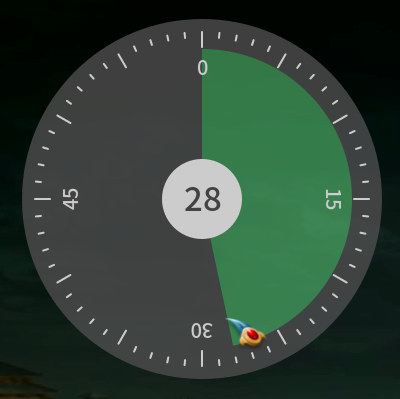
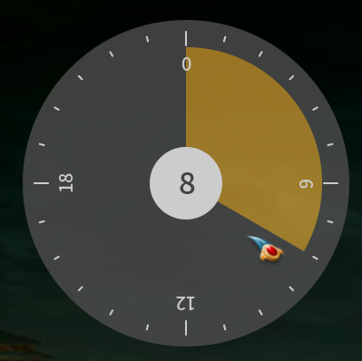
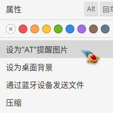

# at-gui
A gui interface of "at" command. (linux)

## 延时模式

- 点击一次，选择延时多少分钟后，提醒。

- 超过60分钟的需求时，可以<u>按住ctrl</u>先选择小时。
  

## 定时模式

需要点击2次，选择小时，分钟。
小时|分钟
--|--
|

## 中途取消

鼠标右键点击中间的白色圆心，可以取消操作。（左键拖动）

## 应用程序菜单

## 文件管理区右键菜单

设置任意PNG图片为<u>**当前**</u>的提醒的图片。

- io.elementary.files （使用contract机制）

- nautilus（使用script机制）还没做，没nautilus。
- 手动设置，软件会跟随链接。
`ln -sf %f $HOME/.local/share/at-gui.png`
- 准备一些有意义的图片吧。
 