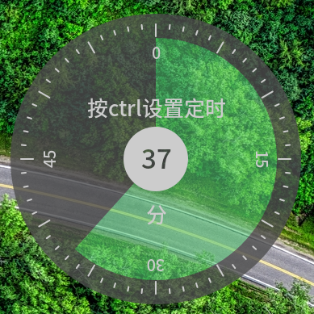
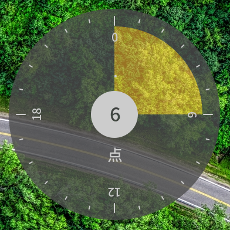
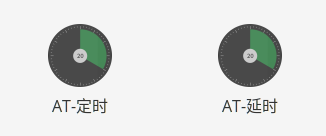
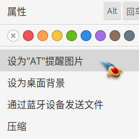

# at-gui
A gui interface of "at" command. (linux)

## 两种模式

缺省`延时模式`。按ctrl设置小时后，是`定时模式`。

延时模式|定时模式
---|---
|
|

## 中途取消

鼠标右键点击中间的白色圆心，可以取消操作。（左键拖动）

## 应用程序菜单

## 文件管理区右键菜单

设置任意PNG图片为<u>**当前**</u>的提醒的图片。

- io.elementary.files （使用contract机制）

- nautilus（使用script机制）还没做，没nautilus。
- 手动设置，软件会跟随链接。
`ln -sf %f $HOME/.local/share/at-gui.png`
- 准备一些有意义的图片吧。

